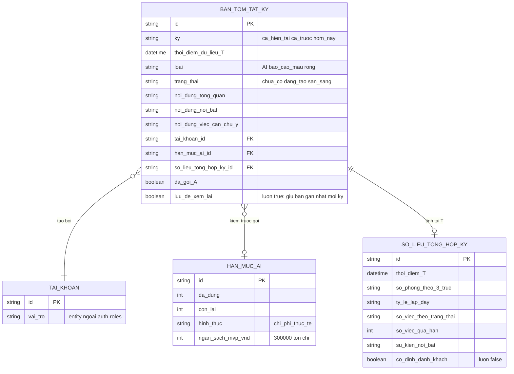

# ai-ops-summary — ERD

> Entity từ SRS Mục 8. SoLieuTongHopKy là số liệu tính toán — không bắt buộc lưu trữ.

```mermaid
erDiagram
    BAN_TOM_TAT_KY }o--|| TAI_KHOAN : "tao boi"
    BAN_TOM_TAT_KY }o--o| HAN_MUC_AI : "kiem truoc goi"
    BAN_TOM_TAT_KY ||--o| SO_LIEU_TONG_HOP_KY : "tinh tai T"

    BAN_TOM_TAT_KY {
        string id PK
        string ky "ca_hien_tai ca_truoc hom_nay"
        datetime thoi_diem_du_lieu_T
        string loai "AI bao_cao_mau rong"
        string trang_thai "chua_co dang_tao san_sang"
        string noi_dung_tong_quan
        string noi_dung_noi_bat
        string noi_dung_viec_can_chu_y
        string tai_khoan_id FK
        string han_muc_ai_id FK
        string so_lieu_tong_hop_ky_id FK
        boolean da_goi_AI
        boolean luu_de_xem_lai "luon true: giu ban gan nhat moi ky"
    }

    HAN_MUC_AI {
        string id PK
        int da_dung
        int con_lai
        string hinh_thuc "chi_phi_thuc_te"
        int ngan_sach_mvp_vnd "300000 ton chi"
    }

    SO_LIEU_TONG_HOP_KY {
        string id PK
        datetime thoi_diem_T
        string so_phong_theo_3_truc
        string ty_le_lap_day
        string so_viec_theo_trang_thai
        int so_viec_qua_han
        string su_kien_noi_bat
        boolean co_dinh_danh_khach "luon false"
    }

    TAI_KHOAN {
        string id PK
        string vai_tro "entity ngoai auth-roles"
    }
```
