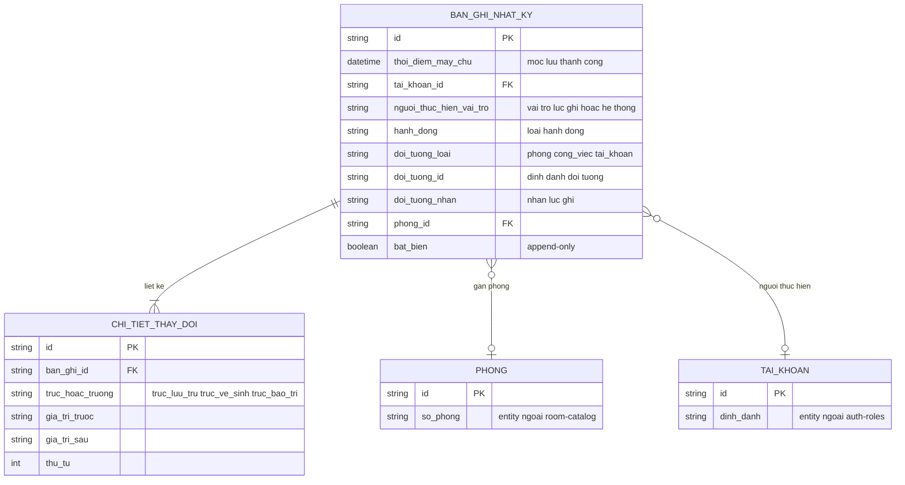

# audit-log — ERD

> Entity nghiệp vụ từ SRS Mục 8. Tham chiếu Phòng/Công việc/Tài khoản thuộc feature khác — chỉ giữ định danh + nhãn chụp trên bản ghi.

```mermaid
erDiagram
    BAN_GHI_NHAT_KY ||--|{ CHI_TIET_THAY_DOI : "liet ke"
    BAN_GHI_NHAT_KY }o--o| PHONG : "gan phong"
    BAN_GHI_NHAT_KY }o--o| TAI_KHOAN : "nguoi thuc hien"

    BAN_GHI_NHAT_KY {
        string id PK
        datetime thoi_diem_may_chu "moc luu thanh cong"
        string tai_khoan_id FK
        string nguoi_thuc_hien_vai_tro "vai tro luc ghi hoac he thong"
        string hanh_dong "loai hanh dong"
        string doi_tuong_loai "phong cong_viec tai_khoan"
        string doi_tuong_id "dinh danh doi tuong"
        string doi_tuong_nhan "nhan luc ghi"
        string phong_id FK
        boolean bat_bien "append-only"
    }

    CHI_TIET_THAY_DOI {
        string id PK
        string ban_ghi_id FK
        string truc_hoac_truong "truc_luu_tru truc_ve_sinh truc_bao_tri"
        string gia_tri_truoc
        string gia_tri_sau
        int thu_tu
    }

    PHONG {
        string id PK
        string so_phong "entity ngoai room-catalog"
    }

    TAI_KHOAN {
        string id PK
        string dinh_danh "entity ngoai auth-roles"
    }
```
