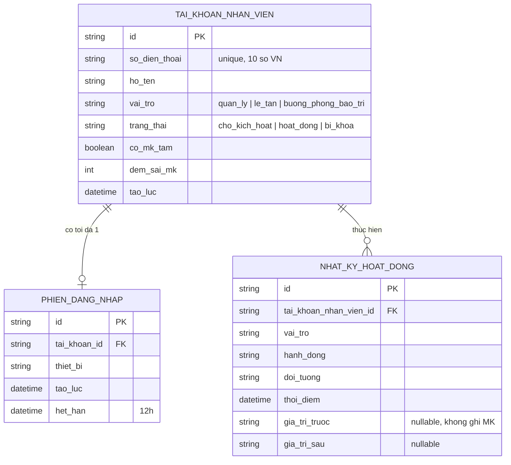

# Auth Roles — ERD

## Entity Relationship

```mermaid
erDiagram
  TAI_KHOAN_NHAN_VIEN ||--o| PHIEN_DANG_NHAP : "co toi da 1"
  TAI_KHOAN_NHAN_VIEN ||--o{ NHAT_KY_HOAT_DONG : "thuc hien"
  TAI_KHOAN_NHAN_VIEN {
    string id PK
    string so_dien_thoai "unique, 10 so VN"
    string ho_ten
    string vai_tro "quan_ly | le_tan | buong_phong_bao_tri"
    string trang_thai "cho_kich_hoat | hoat_dong | bi_khoa"
    boolean co_mk_tam
    int dem_sai_mk
    datetime tao_luc
  }
  PHIEN_DANG_NHAP {
    string id PK
    string tai_khoan_id FK
    string thiet_bi
    datetime tao_luc
    datetime het_han "12h"
  }
  NHAT_KY_HOAT_DONG {
    string id PK
    string tai_khoan_nhan_vien_id FK
    string vai_tro
    string hanh_dong
    string doi_tuong
    datetime thoi_diem
    string gia_tri_truoc "nullable, khong ghi MK"
    string gia_tri_sau "nullable"
  }
```

## Notes

- Không entity "đã xóa" — chỉ khóa (BR-auth-roles-005).
- Vai trò gộp buồng phòng–bảo trì trong MVP (OQ-2 resolved).
