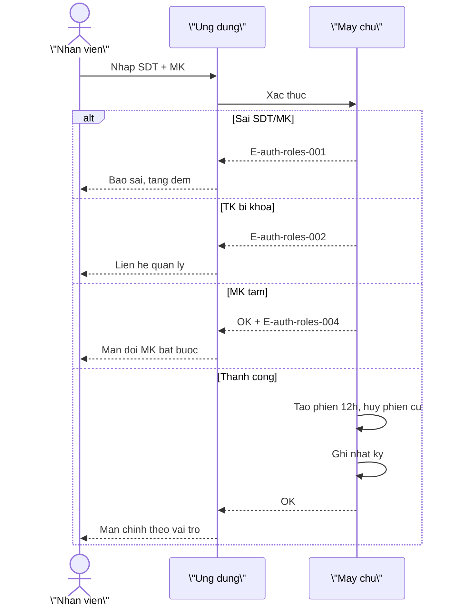
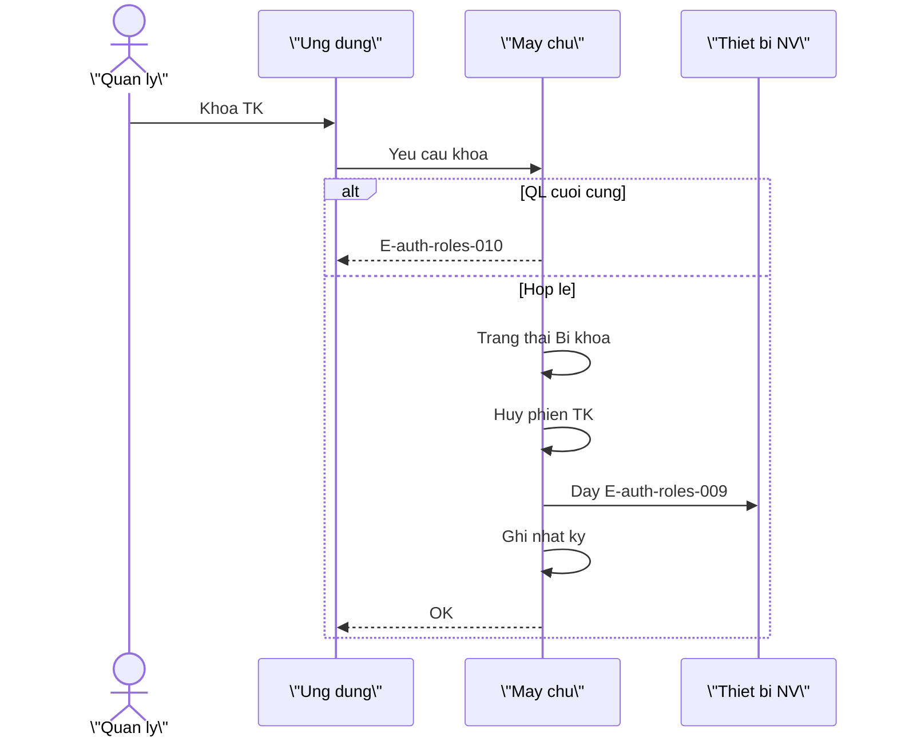
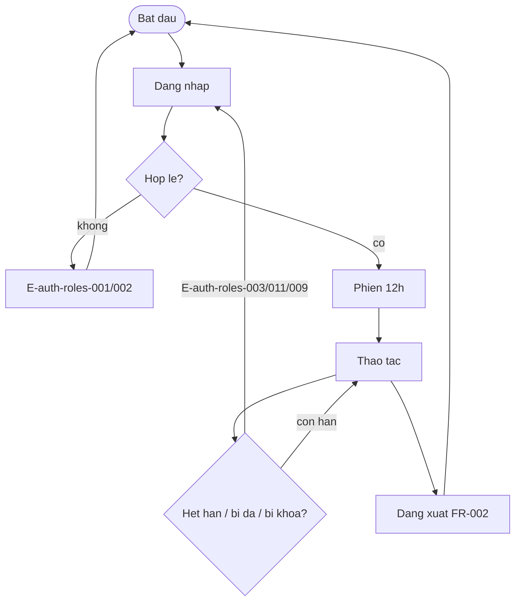

# Auth Roles — Flows

## Flow: Đăng nhập

```mermaid
sequenceDiagram
  actor NV as \"Nhan vien\"
  participant App as \"Ung dung\"
  participant SV as \"May chu\"

  NV->>App: Nhap SDT + MK
  App->>SV: Xac thuc
  alt Sai SDT/MK
    SV-->>App: E-auth-roles-001
    App-->>NV: Bao sai, tang dem
  else TK bi khoa
    SV-->>App: E-auth-roles-002
    App-->>NV: Lien he quan ly
  else MK tam
    SV-->>App: OK + E-auth-roles-004
    App-->>NV: Man doi MK bat buoc
  else Thanh cong
    SV->>SV: Tao phien 12h, huy phien cu
    SV->>SV: Ghi nhat ky
    SV-->>App: OK
    App-->>NV: Man chinh theo vai tro
  end
```

## Flow: Khóa tài khoản (quản lý)

```mermaid
sequenceDiagram
  actor QL as \"Quan ly\"
  participant App as \"Ung dung\"
  participant SV as \"May chu\"
  participant NVApp as \"Thiet bi NV\"

  QL->>App: Khoa TK
  App->>SV: Yeu cau khoa
  alt QL cuoi cung
    SV-->>App: E-auth-roles-010
  else Hop le
    SV->>SV: Trang thai Bi khoa
    SV->>SV: Huy phien TK
    SV->>NVApp: Day E-auth-roles-009
    SV->>SV: Ghi nhat ky
    SV-->>App: OK
  end
```

## Flow: Activity — vòng đời phiên

```mermaid
flowchart TD
  Start(["Bat dau"]) --> Login["Dang nhap"]
  Login --> Valid{"Hop le?"}
  Valid -->|"khong"| Err["E-auth-roles-001/002"]
  Err --> Start
  Valid -->|"co"| Session["Phien 12h"]
  Session --> Work["Thao tac"]
  Work --> Expired{"Het han / bi da / bi khoa?"}
  Expired -->|"E-auth-roles-003/011/009"| Login
  Expired -->|"con han"| Work
  Work --> Logout["Dang xuat FR-002"]
  Logout --> Start
```

