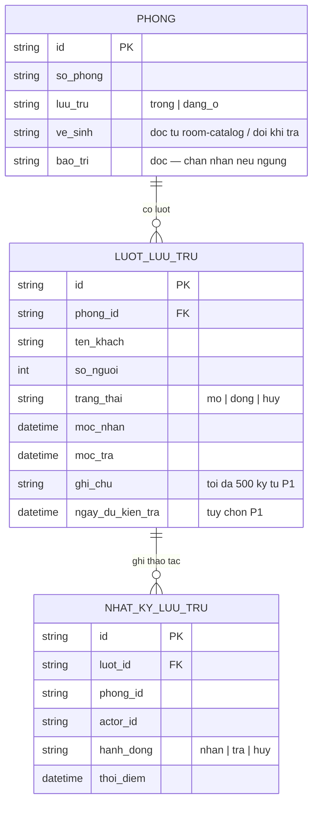

# Check-in-out — ERD

```mermaid
erDiagram
    PHONG ||--o{ LUOT_LUU_TRU : "co luot"
    LUOT_LUU_TRU ||--o{ NHAT_KY_LUU_TRU : "ghi thao tac"

    PHONG {
        string id PK
        string so_phong
        string luu_tru "trong | dang_o"
        string ve_sinh "doc tu room-catalog / doi khi tra"
        string bao_tri "doc — chan nhan neu ngung"
    }

    LUOT_LUU_TRU {
        string id PK
        string phong_id FK
        string ten_khach
        int so_nguoi
        string trang_thai "mo | dong | huy"
        datetime moc_nhan
        datetime moc_tra
        string ghi_chu "toi da 500 ky tu P1"
        datetime ngay_du_kien_tra "tuy chon P1"
    }

    NHAT_KY_LUU_TRU {
        string id PK
        string luot_id FK
        string phong_id
        string actor_id
        string hanh_dong "nhan | tra | huy"
        datetime thoi_diem
    }
```
