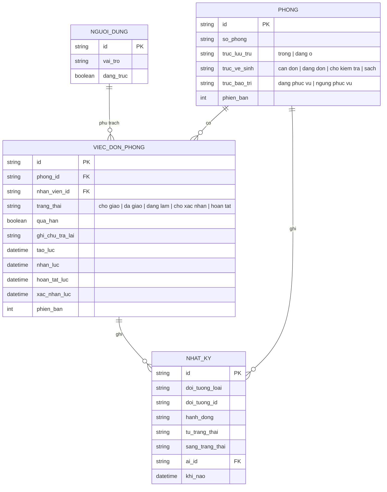

# housekeeping — ERD

```mermaid
erDiagram
    NGUOI_DUNG ||--o{ VIEC_DON_PHONG : "phu trach"
    PHONG ||--o{ VIEC_DON_PHONG : "co"
    VIEC_DON_PHONG ||--o{ NHAT_KY : "ghi"
    PHONG ||--o{ NHAT_KY : "ghi"

    PHONG {
        string id PK
        string so_phong
        string truc_luu_tru "trong | dang o"
        string truc_ve_sinh "can don | dang don | cho kiem tra | sach"
        string truc_bao_tri "dang phuc vu | ngung phuc vu"
        int phien_ban
    }

    VIEC_DON_PHONG {
        string id PK
        string phong_id FK
        string nhan_vien_id FK
        string trang_thai "cho giao | da giao | dang lam | cho xac nhan | hoan tat"
        boolean qua_han
        string ghi_chu_tra_lai
        datetime tao_luc
        datetime nhan_luc
        datetime hoan_tat_luc
        datetime xac_nhan_luc
        int phien_ban
    }

    NGUOI_DUNG {
        string id PK
        string vai_tro
        boolean dang_truc
    }

    NHAT_KY {
        string id PK
        string doi_tuong_loai
        string doi_tuong_id
        string hanh_dong
        string tu_trang_thai
        string sang_trang_thai
        string ai_id FK
        datetime khi_nao
    }
```

> "Sẵn sàng" = trống + sạch + đang phục vụ — composite suy ra, không phải trường lưu (BR-housekeeping-003). Nguồn danh sách đang trực — OQ-1.
