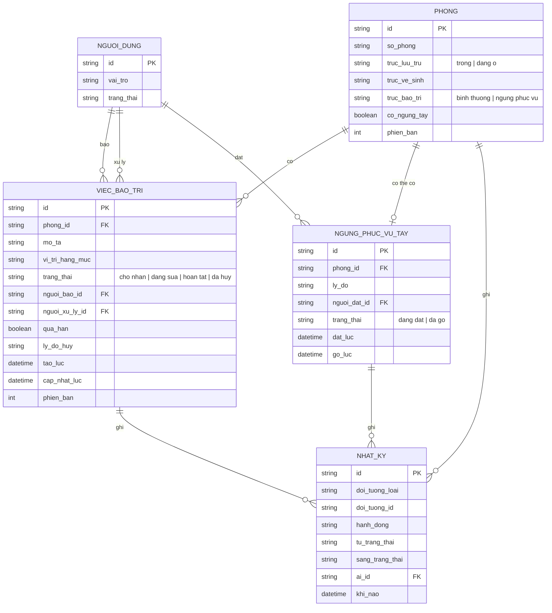

# maintenance — ERD

```mermaid
erDiagram
    NGUOI_DUNG ||--o{ VIEC_BAO_TRI : "bao"
    NGUOI_DUNG ||--o{ VIEC_BAO_TRI : "xu ly"
    NGUOI_DUNG ||--o{ NGUNG_PHUC_VU_TAY : "dat"
    PHONG ||--o{ VIEC_BAO_TRI : "co"
    PHONG ||--o| NGUNG_PHUC_VU_TAY : "co the co"
    VIEC_BAO_TRI ||--o{ NHAT_KY : "ghi"
    PHONG ||--o{ NHAT_KY : "ghi"
    NGUNG_PHUC_VU_TAY ||--o{ NHAT_KY : "ghi"

    PHONG {
        string id PK
        string so_phong
        string truc_luu_tru "trong | dang o"
        string truc_ve_sinh
        string truc_bao_tri "binh thuong | ngung phuc vu"
        boolean co_ngung_tay
        int phien_ban
    }

    VIEC_BAO_TRI {
        string id PK
        string phong_id FK
        string mo_ta
        string vi_tri_hang_muc
        string trang_thai "cho nhan | dang sua | hoan tat | da huy"
        string nguoi_bao_id FK
        string nguoi_xu_ly_id FK
        boolean qua_han
        string ly_do_huy
        datetime tao_luc
        datetime cap_nhat_luc
        int phien_ban
    }

    NGUNG_PHUC_VU_TAY {
        string id PK
        string phong_id FK
        string ly_do
        string nguoi_dat_id FK
        string trang_thai "dang dat | da go"
        datetime dat_luc
        datetime go_luc
    }

    NGUOI_DUNG {
        string id PK
        string vai_tro
        string trang_thai
    }

    NHAT_KY {
        string id PK
        string doi_tuong_loai
        string doi_tuong_id
        string hanh_dong
        string tu_trang_thai
        string sang_trang_thai
        string ai_id FK
        datetime khi_nao
    }
```
