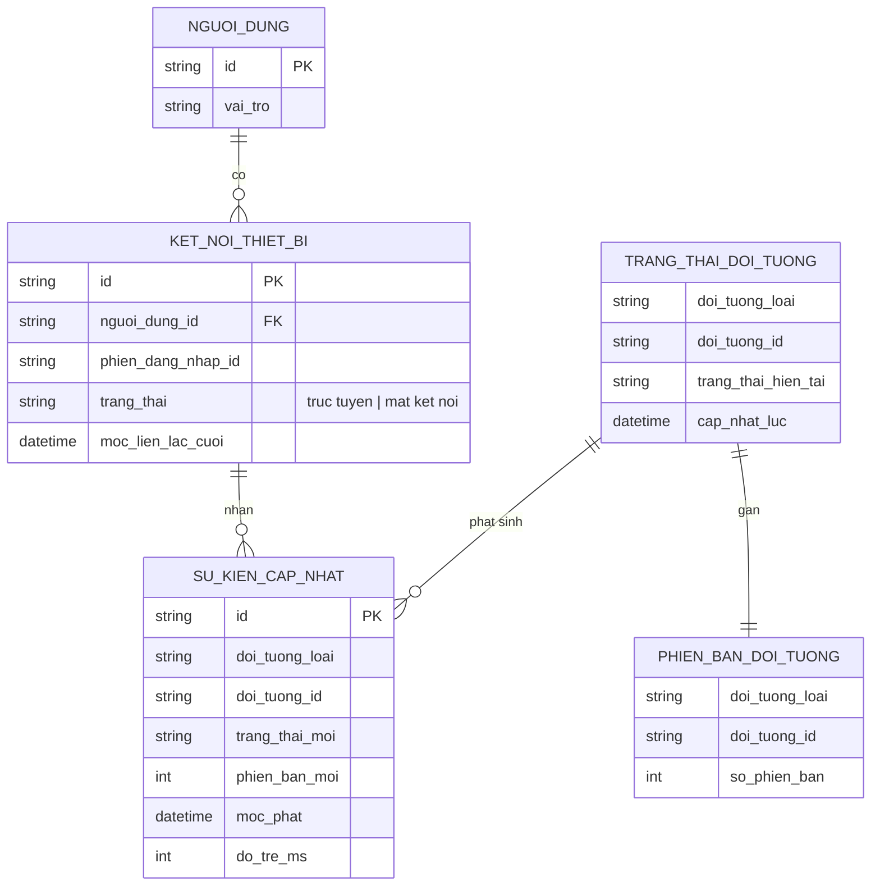

# realtime-sync — ERD

```mermaid
erDiagram
    NGUOI_DUNG ||--o{ KET_NOI_THIET_BI : "co"
    KET_NOI_THIET_BI ||--o{ SU_KIEN_CAP_NHAT : "nhan"
    TRANG_THAI_DOI_TUONG ||--|| PHIEN_BAN_DOI_TUONG : "gan"
    TRANG_THAI_DOI_TUONG ||--o{ SU_KIEN_CAP_NHAT : "phat sinh"

    KET_NOI_THIET_BI {
        string id PK
        string nguoi_dung_id FK
        string phien_dang_nhap_id
        string trang_thai "truc tuyen | mat ket noi"
        datetime moc_lien_lac_cuoi
    }

    SU_KIEN_CAP_NHAT {
        string id PK
        string doi_tuong_loai
        string doi_tuong_id
        string trang_thai_moi
        int phien_ban_moi
        datetime moc_phat
        int do_tre_ms
    }

    PHIEN_BAN_DOI_TUONG {
        string doi_tuong_loai
        string doi_tuong_id
        int so_phien_ban
    }

    TRANG_THAI_DOI_TUONG {
        string doi_tuong_loai
        string doi_tuong_id
        string trang_thai_hien_tai
        datetime cap_nhat_luc
    }

    NGUOI_DUNG {
        string id PK
        string vai_tro
    }
```
