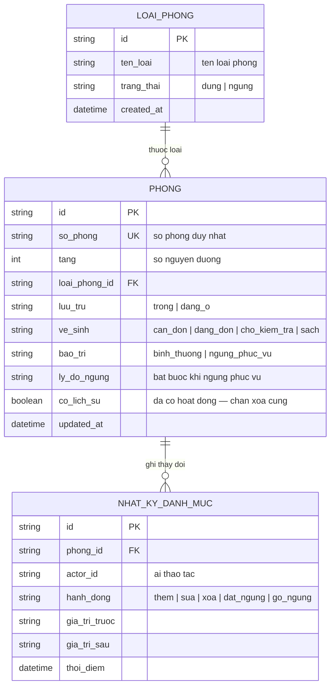

# Room Catalog — ERD

```mermaid
erDiagram
    LOAI_PHONG ||--o{ PHONG : "thuoc loai"
    PHONG ||--o{ NHAT_KY_DANH_MUC : "ghi thay doi"

    LOAI_PHONG {
        string id PK
        string ten_loai "ten loai phong"
        string trang_thai "dung | ngung"
        datetime created_at
    }

    PHONG {
        string id PK
        string so_phong UK "so phong duy nhat"
        int tang "so nguyen duong"
        string loai_phong_id FK
        string luu_tru "trong | dang_o"
        string ve_sinh "can_don | dang_don | cho_kiem_tra | sach"
        string bao_tri "binh_thuong | ngung_phuc_vu"
        string ly_do_ngung "bat buoc khi ngung phuc vu"
        boolean co_lich_su "da co hoat dong — chan xoa cung"
        datetime updated_at
    }

    NHAT_KY_DANH_MUC {
        string id PK
        string phong_id FK
        string actor_id "ai thao tac"
        string hanh_dong "them | sua | xoa | dat_ngung | go_ngung"
        string gia_tri_truoc
        string gia_tri_sau
        datetime thoi_diem
    }
```
