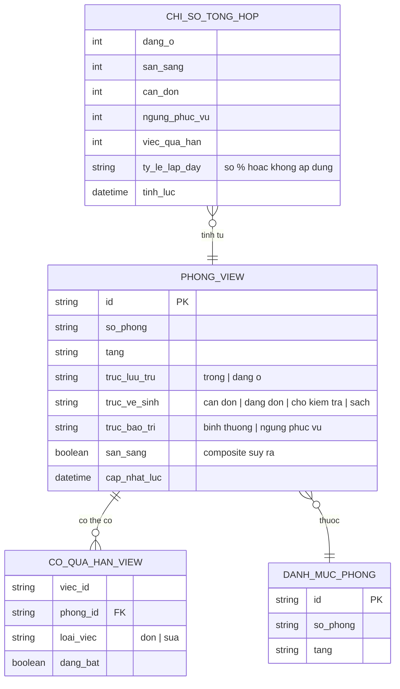

# room-dashboard — ERD

> Dashboard chỉ đọc — không sở hữu trạng thái phòng. Entity dưới đây là view nghiệp vụ tại thời điểm xem.

```mermaid
erDiagram
    PHONG_VIEW ||--o{ CO_QUA_HAN_VIEW : "co the co"
    PHONG_VIEW }o--|| DANH_MUC_PHONG : "thuoc"
    CHI_SO_TONG_HOP }o--|| PHONG_VIEW : "tinh tu"

    PHONG_VIEW {
        string id PK
        string so_phong
        string tang
        string truc_luu_tru "trong | dang o"
        string truc_ve_sinh "can don | dang don | cho kiem tra | sach"
        string truc_bao_tri "binh thuong | ngung phuc vu"
        boolean san_sang "composite suy ra"
        datetime cap_nhat_luc
    }

    CHI_SO_TONG_HOP {
        int dang_o
        int san_sang
        int can_don
        int ngung_phuc_vu
        int viec_qua_han
        string ty_le_lap_day "so % hoac khong ap dung"
        datetime tinh_luc
    }

    CO_QUA_HAN_VIEW {
        string viec_id
        string phong_id FK
        string loai_viec "don | sua"
        boolean dang_bat
    }

    DANH_MUC_PHONG {
        string id PK
        string so_phong
        string tang
    }
```
